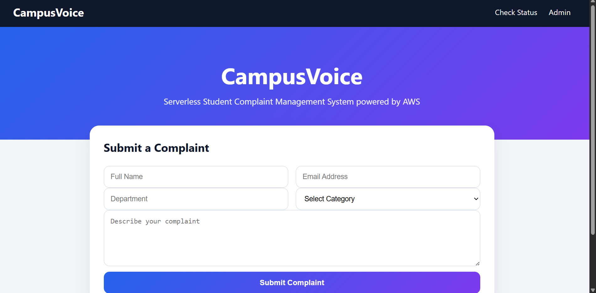
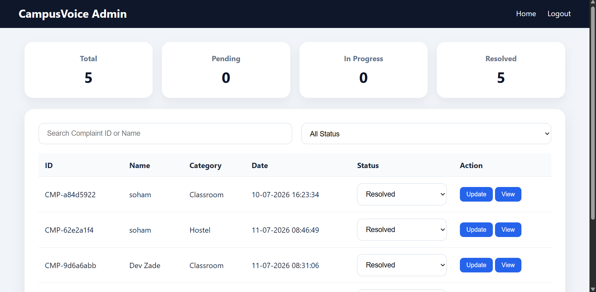
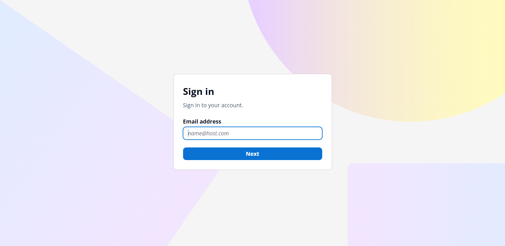
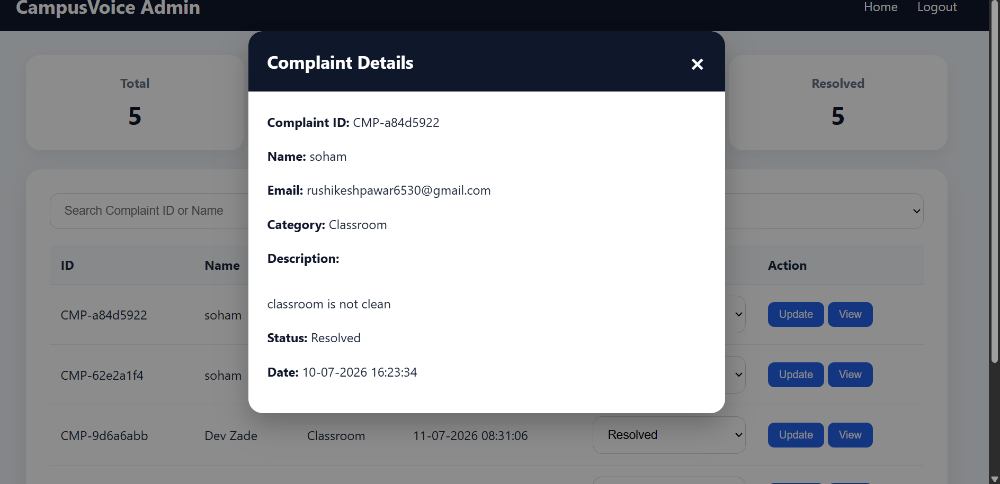
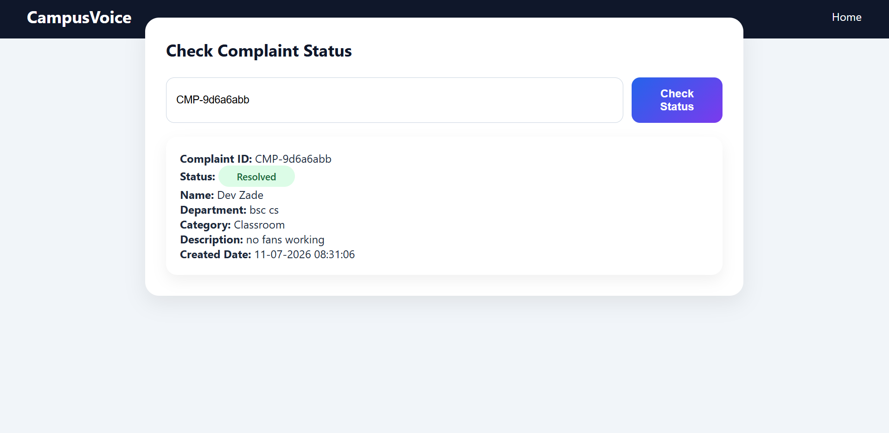

# CampusVoice – AWS Complaint Management System

CampusVoice is a **serverless student complaint management system** built using Amazon Web Services (AWS).

The system allows students to:

* Submit complaints online
* Receive a unique Complaint ID
* Check the status of their complaint
* View updated complaint information

Administrators can securely log in using **Amazon Cognito**, view submitted complaints, search/filter complaints, view complaint details, and update complaint statuses.

The project demonstrates practical implementation of **AWS serverless architecture, REST APIs, authentication, IAM least privilege, monitoring, and auditing**.

---

## 📌 Project Overview

CampusVoice replaces a traditional manual complaint process with a cloud-based system.

### Student

1. Opens the CampusVoice website
2. Submits a complaint
3. Receives a unique Complaint ID
4. Uses the Complaint ID to check the complaint status

### Administrator

1. Opens the Admin Login page
2. Authenticates using Amazon Cognito
3. Accesses the Admin Dashboard
4. Views submitted complaints
5. Searches or filters complaints
6. Opens complaint details
7. Updates the complaint status

Supported complaint statuses:

* **Pending**
* **In Progress**
* **Resolved**

---

# 🏗️ AWS Architecture

```text
                         ┌─────────────────────┐
                         │       Student       │
                         └──────────┬──────────┘
                                    │
                                    ▼
                         ┌─────────────────────┐
                         │     CloudFront      │
                         └──────────┬──────────┘
                                    │
                                    ▼
                         ┌─────────────────────┐
                         │     Amazon S3       │
                         │  Static Web Hosting │
                         └─────────────────────┘
                                    │
                         Submit / Check Status
                                    │
                                    ▼
                         ┌─────────────────────┐
                         │    API Gateway      │
                         └──────────┬──────────┘
                                    │
                                    ▼
                         ┌─────────────────────┐
                         │   AWS Lambda        │
                         └──────────┬──────────┘
                                    │
                                    ▼
                         ┌─────────────────────┐
                         │    DynamoDB         │
                         │      Complaints     │
                         └─────────────────────┘


                         ┌─────────────────────┐
                         │      Admin          │
                         └──────────┬──────────┘
                                    │
                                    ▼
                         ┌─────────────────────┐
                         │ Amazon Cognito      │
                         │  Managed Login      │
                         └──────────┬──────────┘
                                    │
                                    ▼
                         ┌─────────────────────┐
                         │  Admin Dashboard    │
                         └──────────┬──────────┘
                                    │
                                    ▼
                         ┌─────────────────────┐
                         │    API Gateway      │
                         │ Cognito Authorizer  │
                         └──────────┬──────────┘
                                    │
                                    ▼
                         ┌─────────────────────┐
                         │   AWS Lambda        │
                         │ Get / Update        │
                         └──────────┬──────────┘
                                    │
                                    ▼
                         ┌─────────────────────┐
                         │    DynamoDB         │
                         │      Complaints     │
                         └─────────────────────┘


        Security & Monitoring
        ┌──────────────────────────────────────────────┐
        │ IAM │ CloudWatch │ CloudTrail │ Cognito      │
        └──────────────────────────────────────────────┘
```

---

# ☁️ AWS Services Used

| AWS Service            | Purpose                                          |
| ---------------------- | ------------------------------------------------ |
| **Amazon S3**          | Hosts the static frontend                        |
| **Amazon CloudFront**  | Provides HTTPS delivery and content distribution |
| **Amazon API Gateway** | Provides REST API endpoints                      |
| **AWS Lambda**         | Runs backend serverless functions                |
| **Amazon DynamoDB**    | Stores complaint information                     |
| **Amazon Cognito**     | Provides administrator authentication            |
| **AWS IAM**            | Controls permissions for Lambda functions        |
| **Amazon CloudWatch**  | Lambda monitoring and logs                       |
| **AWS CloudTrail**     | AWS API activity auditing                        |

---

# 🔐 Security Implementation

Security was implemented using multiple AWS services.

### Amazon Cognito

Administrator authentication is handled using **Amazon Cognito Managed Login**.

The project uses:

* Cognito User Pool
* Cognito App Client
* OAuth 2.0 Authorization Code Grant
* PKCE
* Cognito Managed Login
* Cognito access and ID tokens

Self-registration is disabled, so administrator accounts are created and controlled by the project administrator.

### API Gateway Authorization

The following administrator operations are protected by a Cognito Authorizer:

```text
GET  /complaints
PUT  /complaints
```

Students can submit complaints without administrator authentication:

```text
POST /complaints
```

Students can also check an individual complaint using its Complaint ID:

```text
GET /complaints/{ComplaintID}
```

---

# 🔑 IAM Least Privilege

Lambda functions were configured with specific DynamoDB permissions instead of using unrestricted database access.

Examples:

### CreateComplaint

Permissions include:

```text
dynamodb:PutItem
dynamodb:GetItem
dynamodb:UpdateItem
dynamodb:Scan
```

### GetComplaints

Permissions include:

```text
dynamodb:Scan
dynamodb:GetItem
```

### GetComplaintStatus

Permission:

```text
dynamodb:GetItem
```

### UpdateComplaintStatus

Permission:

```text
dynamodb:UpdateItem
```

This follows the **principle of least privilege**, giving each Lambda function only the DynamoDB permissions required for its operation.

---

# 📊 Monitoring with CloudWatch

Amazon CloudWatch is used to monitor Lambda execution and application activity.

Lambda log groups were configured with a **30-day retention period**.

The project includes CloudWatch log groups for the Lambda functions, including:

```text
/aws/lambda/CreateComplaint
/aws/lambda/GetComplaints
/aws/lambda/GetComplaintStatus
/aws/lambda/UpdateComplaintStatus
/aws/lambda/ComplaintHandler
/aws/lambda/CampusVoiceAdminLogin
```

---

# 📝 Auditing with CloudTrail

AWS CloudTrail is configured using the trail:

```text
CampusVoice-AuditTrail
```

CloudTrail provides an audit record of AWS API activity associated with the project.

This helps with:

* Security auditing
* Troubleshooting
* Tracking AWS API activity
* Understanding changes made to AWS resources

---

# 🗄️ DynamoDB Database

The project uses an Amazon DynamoDB table named:

```text
Complaints
```

### Primary Key

```text
ComplaintID
```

### Complaint Attributes

| Attribute     | Description                 |
| ------------- | --------------------------- |
| `ComplaintID` | Unique complaint identifier |
| `Name`        | Student name                |
| `Email`       | Student email               |
| `Department`  | Student department          |
| `Category`    | Complaint category          |
| `Description` | Complaint description       |
| `CreatedDate` | Complaint creation date     |
| `Status`      | Current complaint status    |

### Status Values

```text
Pending
In Progress
Resolved
```

---

# ⚡ AWS Lambda Functions

| Lambda Function         | Purpose                                                                            |
| ----------------------- | ---------------------------------------------------------------------------------- |
| `CreateComplaint`       | Creates and stores new complaints                                                  |
| `GetComplaints`         | Retrieves complaints for the admin dashboard                                       |
| `UpdateComplaintStatus` | Updates complaint status                                                           |
| `GetComplaintStatus`    | Retrieves an individual complaint by Complaint ID                                  |
| `ComplaintHandler`      | Supporting Lambda function used during development                                 |
| `CampusVoiceAdminLogin` | Legacy custom login Lambda retained from the earlier authentication implementation |

> **Note:** The current administrator authentication system uses **Amazon Cognito**. `CampusVoiceAdminLogin` is a legacy function from the earlier custom username/password implementation and is not the current authentication mechanism.

---

# 🌐 API Endpoints

Base API:

```text
https://87frpah2gl.execute-api.ap-south-1.amazonaws.com/prod/
```

### Submit Complaint

```text
POST /complaints
```

Used by students to submit a complaint.

### Get Complaints

```text
GET /complaints
```

Used by the authenticated administrator dashboard.

### Update Complaint Status

```text
PUT /complaints
```

Used by administrators to update complaint status.

### Check Complaint Status

```text
GET /complaints/{ComplaintID}
```

Used by students to retrieve an individual complaint.

---

# 🖥️ Frontend

The frontend is built using:

* HTML
* CSS
* JavaScript

The website is hosted using Amazon S3 and delivered through Amazon CloudFront.

### Frontend Pages

```text
index.html
admin-login.html
admin.html
cognito-callback.html
complaint status.html
```

### Supporting Files

```text
css/style.css
script.js
admin.js
```

---

# 📸 Project Screenshots

## Student Complaint Form

Students can enter their details and submit a complaint.



---

## Admin Dashboard

The administrator dashboard displays complaint statistics and submitted complaints.



---

## Administrator Cognito Login

Administrators authenticate through Amazon Cognito Managed Login.



---

## View Complaint

Administrators can open individual complaints and view their complete details.



---

## Student Complaint Status

Students can enter their Complaint ID to check the current status of their complaint.



---

# 🔄 Application Workflow

## Student Complaint Submission

```text
Student
   │
   ▼
CampusVoice Website
   │
   ▼
POST /complaints
   │
   ▼
API Gateway
   │
   ▼
CreateComplaint Lambda
   │
   ▼
DynamoDB
   │
   ▼
Complaint ID generated
```

---

## Administrator Workflow

```text
Admin
   │
   ▼
Cognito Managed Login
   │
   ▼
Authentication
   │
   ▼
Admin Dashboard
   │
   ▼
Cognito Authorizer
   │
   ▼
API Gateway
   │
   ▼
Lambda
   │
   ▼
DynamoDB
```

---

## Complaint Status Workflow

```text
Student
   │
   ▼
Enter Complaint ID
   │
   ▼
GET /complaints/{ComplaintID}
   │
   ▼
API Gateway
   │
   ▼
GetComplaintStatus Lambda
   │
   ▼
DynamoDB
   │
   ▼
Current Complaint Status
```

---

# 📁 Project Structure

```text
CampusVoice_Pro_Frontend/
│
├── index.html
├── admin-login.html
├── admin.html
├── cognito-callback.html
├── complaint status.html
│
├── script.js
├── admin.js
│
├── css/
│   └── style.css
│
└── images/
    ├── home-page.png
    ├── admin-dashboard.png
    ├── Admin-cognito.login.png
    ├── view-complaint.png
    └── complaint-status.png
```

---

# 🚀 Deployment

The frontend was deployed to Amazon S3 and delivered through Amazon CloudFront.

### S3

Static website hosting is enabled on the S3 bucket.

### CloudFront

CloudFront provides HTTPS access to the application.

Current CloudFront distribution URL:

```text
https://d3myim0g3fz9he.cloudfront.net
```

### Backend

The backend is deployed using:

* API Gateway
* AWS Lambda
* DynamoDB

### Authentication

Administrator authentication is handled by:

* Amazon Cognito User Pool
* Cognito App Client
* Cognito Managed Login
* API Gateway Cognito Authorizer

---

# 🧪 Testing

The complete application workflow was tested end-to-end.

### Student

* [x] Open complaint form
* [x] Submit complaint
* [x] Generate Complaint ID
* [x] Check complaint status
* [x] View updated complaint status

### Administrator

* [x] Login using Cognito
* [x] Access admin dashboard
* [x] View complaints
* [x] Search complaints
* [x] Filter complaints
* [x] View complaint details
* [x] Update complaint status
* [x] Logout successfully

### AWS

* [x] API Gateway integration tested
* [x] Lambda functions tested
* [x] DynamoDB operations tested
* [x] IAM permissions restricted
* [x] CloudWatch logging configured
* [x] CloudTrail audit trail configured
* [x] Cognito authentication configured
* [x] CloudFront deployment tested

---

# 🎯 Learning Outcomes

Through this project, I gained practical experience with:

* AWS serverless architecture
* Amazon S3 static website hosting
* Amazon CloudFront
* API Gateway REST APIs
* AWS Lambda
* Amazon DynamoDB
* Amazon Cognito
* IAM policies and least privilege
* API authentication and authorization
* CloudWatch logging
* CloudTrail auditing
* REST API integration
* Frontend-to-cloud integration
* Debugging AWS services
* Deploying a complete cloud-based application

---

# 🔮 Future Improvements

Possible future improvements include:

* Custom domain using Amazon Route 53
* SSL/TLS certificate using AWS Certificate Manager
* Private S3 bucket with CloudFront Origin Access Control
* Email notifications for complaint status changes
* Multiple administrator roles
* Improved analytics and reporting
* Automated testing
* Infrastructure as Code using AWS CloudFormation or Terraform
* Additional application monitoring

---

# 👨‍💻 Author

**Rushikesh Pawar**

B.Sc. Information Technology
AWS Certified Cloud Practitioner

Interested in:

* Cloud Engineering
* Cloud Support
* AWS Support
* IT Infrastructure

---

# 📄 License

This project was created for educational and portfolio purposes.
